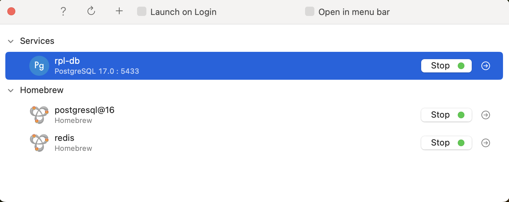
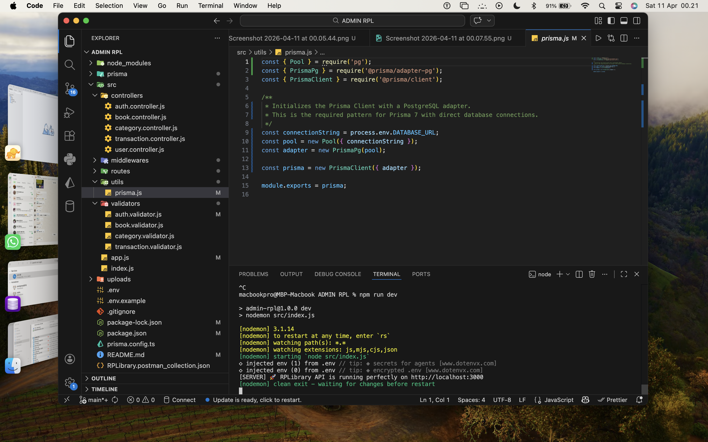
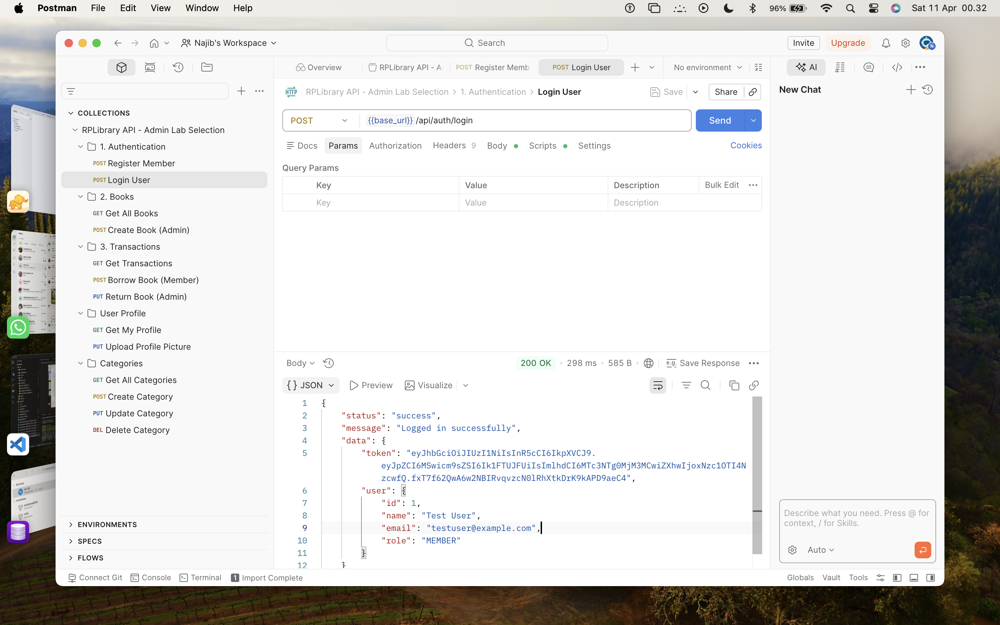
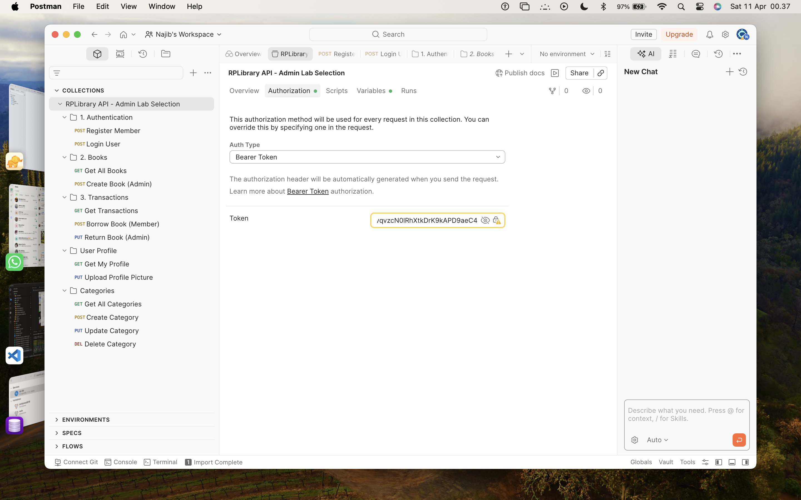
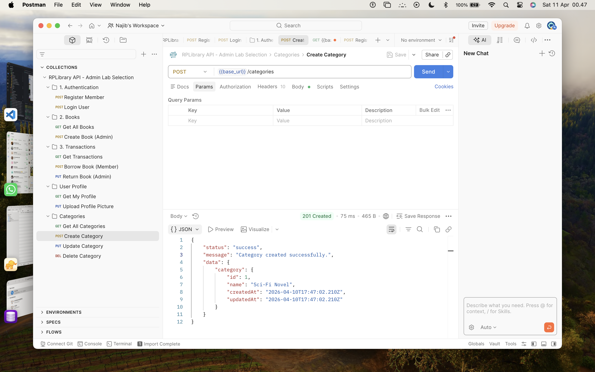
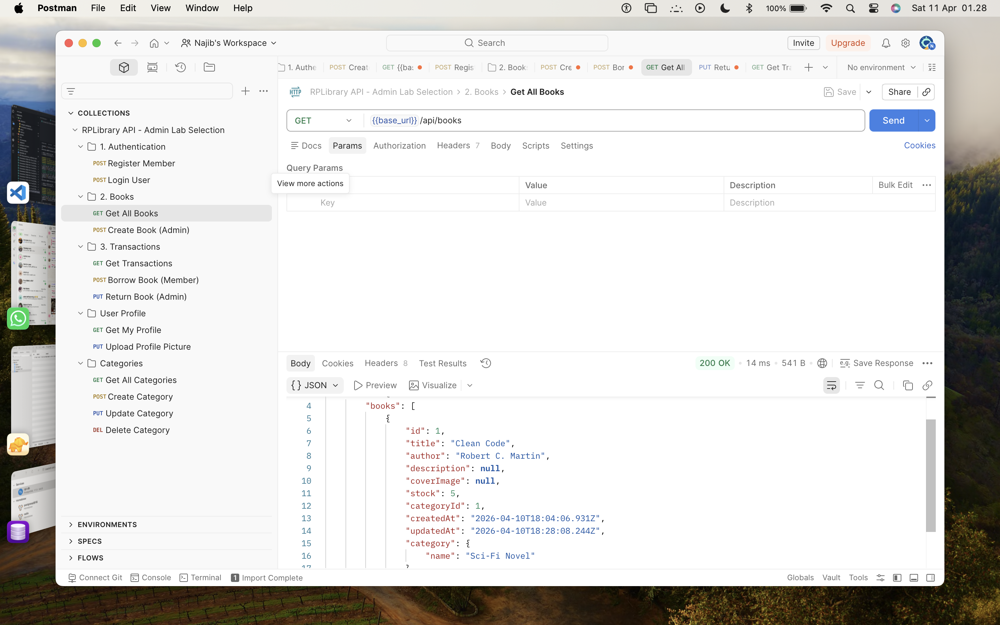

# RPLibrary Backend API 📚🚀

Proyek ini adalah API backend untuk sistem manajemen perpustakaan **RPLibrary**, dibuat khusus untuk menuntaskan evaluasi **Seleksi Admin Lab RPL 2026**. Proyek ini dioptimalkan untuk lingkungan **macOS** (misalnya menggunakan library `bcryptjs` agar kompilasi native Mac aman) dan dilengkapi dengan Arsitektur Modular, validasi berbasis `Zod`, upload file via `Multer`, serta `PostgreSQL` lewat Prisma ORM.

## Tech Stack
- **Runtime**: Node.js v20+
- **Framework**: Express.js
- **ORM**: Prisma ORM
- **Database**: PostgreSQL / MySQL
- **Validation**: Zod
- **Auth**: JWT (JSON Web Token) & `bcryptjs`
- **File Upload**: Multer

---

## 🛠 Instalasi & Cara Menjalankan Server di macOS

### 1. Persiapan Database (Mac)
Anda disarankan menggunakan **DBngin** untuk menyalakan server PostgreSQL/MySQL lokal, dan **TablePlus** untuk melihat datanya.
- Buka **DBngin**, buat server PostgreSQL baru lalu Start.
- Catat port (biasanya `5432`).
- Buka **TablePlus**, koneksikan, dan buat database baru bernama `rplibrary`.

### 2. Konfigurasi Proyek
1. Buka Terminal dan clone repository ini / masuk ke foldernya.
2. Install semua dependency:
   ```bash
   npm install
   ```

3. Buat file `.env` berdasarkan contoh yang telah saya buat di `.env.example`.
   Sesuaikan `DATABASE_URL` jika password root di DBngin Anda berbeda (default DBngin MacOS biasanya username `root` no password, tapi di `.env.example` saya anggap general).
   ```bash
   cp .env.example .env
   ```

### 3. Setup Database (Prisma Migrations)
Jalankan perintah ini agar Prisma membuat tabel (User, Book, Category, Transaction) ke dalam database secara otomatis:
```bash
npx prisma db push
```

*(Opsional) Jika ingin memasukkan data dummy (Seeding), Anda dapat memasukkan baris manual via TablePlus terlebih dahulu sebelum fitur tambah buku dipakai.*

### 4. Jalankan Aplikasi
Aplikasi sudah dikonfigurasi dengan `nodemon` agar server restart otomatis saat ada perubahan kode:
```bash
npm run dev
```

Jika muncul `🚀 RPLibrary API is running perfectly on http://localhost:3000`, maka server sudah siap dipakai! 🎉

---

### 5. Pengujian API dengan Postman

Agar pengujian lebih mudah, sebuah file konfigurasi Postman Collection telah disertakan:

1. Buka aplikasi **Postman**.
2. Klik **Import** -> Pilih file `RPLibrary.postman_collection.json` yang ada di root direktori proyek ini.
3. Di dalam collection tersebut, Anda akan menemukan daftar endpoint Auth, Books, Transactions, dll.
4. **Penting (Authorization)**: Setiap request mewarisi Token dari setting collection (`Inherit auth from parent`). Pastikan untuk menyalin token JWT hasil **Login** ke tab Authorization (pilih Bearer Token) di tingkat Collection atau pada request yang bersangkutan.

### 6. Cara Upload Cover Image di Postman (atau menggunakan cURL)
Jika ingin menguji upload foto untuk penambahan Buku atau Ganti Profil, pastikan Anda menggunakan **form-data** pada Postman:
1. Masuk ke request (misal: POST `/api/books` atau PUT `/api/users/me/profile-picture`).
2. Masuk ke tab **Body** lalu pilih **form-data**.
3. Di kolom KEY, ketik `coverImage` (untuk buku) atau `profileImage` (untuk profil).
4. Ubah tipe KEY dari `Text` menjadi `File` di dropdown sebelah kanan tulisan KEY.
5. Klik **Select Files** lalu cari gambar yang ingin diupload. Isikan data lainnya seperti biasa.
6. Lalu tekan **Send**.

Atau, jika menggunakan terminal (cURL), contoh eksekusinya:
```bash
curl -X POST http://localhost:3000/api/books \
  -H "Authorization: Bearer <TOKEN_ADMIN>" \
  -F "title=Belajar Node.js" \
  -F "stock=10" \
  -F "categoryId=1" \
  -F "coverImage=@/lokasi/gambar/komputer/anda.jpg"
```

---

## 📸 Bukti Implementasi & Pengujian

Berikut ini adalah rangkaian screenshot yang membuktikan fungsionalitas dan konfigurasi database dari proyek RPLibrary:

### Tahap 1: Persiapan Database
**1. DBngin PostgreSQL Berjalan di Port 5433**


**2. Koneksi ke TablePlus**


**3. Konfigurasi Environment & Push Prisma**


**4. TablePlus Koneksi Berhasil & Kosong (Ready)**


**5. Server Berjalan Normal**


---

### Tahap 2: Autentikasi Pengguna
**6. Register Member Berhasil (POST `/api/auth/register`)**


**7. Login Berhasil Mendapatkan JWT Token (POST `/api/auth/login`)**


**8. Konfigurasi Authorization Postman (`Inherit From Parent`)**


---

### Tahap 3: Role Based Access & Entitas
**9. Pengujian Role: Gagal Create Category karena bukan ADMIN**


**10. Admin Berhasil Membuat Kategori (POST `/api/categories`)**


**11. Admin Berhasil Membuat Buku (POST `/api/books`)**


---

### Tahap 4: Sistem Transaksi & Profil
**12. Member Berhasil Meminjam Buku (POST `/api/transactions/borrow`)**


**13. Admin Mengonfirmasi Pengembalian Buku (PUT `/api/transactions/:id/return`)**


**14. Mengambil Semua Daftar Buku (GET `/api/books`)**


**15. Fitur Melihat Profil Sendiri (GET `/api/users/me`)**


---
*Dibuat oleh Tim Spesial untuk Seleksi Admin Lab RPL ITS 2026. Deployment Readiness Checked! 🎉*
